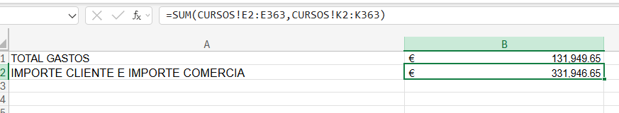

### Atajos de teclado muy útiles

- **Ctrl + Flecha**
  
  - `Ctrl + Flecha abajo` → Salta al último dato de la columna.
  - `Ctrl + Flecha arriba` → Salta al primer dato de la columna.
  - `Ctrl + Flecha derecha` → Último dato de la fila.
  - `Ctrl + Flecha izquierda` → Primer dato de la fila.
  - `Ctrl + Shift + Flecha` → Te mueve hasta el borde del bloque de datos (la última celda antes de un hueco).
  - `Ctrl + Shift + Flecha abajo` → Selecciona toda la columna de datos desde la celda actual hasta el final del bloque.
  - `Ctrl + Shift + Flecha arriba` →Selecciona hacia arriba hasta el inicio del bloque.
  - `Ctrl + Shift + Flecha derecha`→ Selecciona toda la fila hacia la derecha.
  - `Ctrl + Shift + Flecha izquierda` → Selecciona toda la fila hacia la izquierda.
    
- En una tabla inteligente, esto selecciona solo el rango de datos, no toda la hoja.
  - `Ctrl + Barra espaciadora` → Selecciona toda la columna de la hoja, no solo la tabla.
  - `Ctrl + Shift + Barra espaciadora` →Selecciona toda la tabla completa (encabezados + datos).
  - `Shift + Barra espaciadora` → Selecciona toda la fila.


--- 
| Atajo | Acción |
|:--|:--|
| Ctrl + Flecha | Saltar al borde del bloque |
| Shift + Flecha | Seleccionar celda a celda |
| Ctrl + Shift + Flecha | Seleccionar hasta el final del bloque |
|Ctrl + Barra espaciadora| Seleccionar columna completa|
|Shift + Barra espaciadora|Seleccionar fila completa|
|Ctrl + Shift + Barra espaciadora|Seleccionar toda la tabla|
Ctrl + A| |Seleccionar tabla (datos → completa)|

----
**tener encuenta que:**

- seguía las instrucciones del curso pero al tener  mi excel esta en ingles 
es importante recordar 


| Idioma Excel| Función| Separador|
|:--|:--|:--|
| Español| SUMA|; |
|Inglés| SUM | , |


| Idioma | Decimal | Separador de argumentos | Ejemplo |
|:--|:--|:--|:--|
| Español |,|; |=SUMA(A1;B1) |
|Inglés|. |, ||=SUM(A1, B1) |


## Funciones vinculando hojas de cálculo I
Podemos realizar cálculos desde una hoja llamando  datos que se encuentran en una hoja diferente tambien contamos con funciones.


### Función SUMA

“Podemos sumar todas las celdas que seleccionemos desde un rango hasta un máximo de 256 rango.”

### Practica
En el fichero 17. BD CURSOS RANGO descargado antes, calcula en la celda B2 la suma de las duraciones de la hoja CURSOS y en la celda B3 la suma del IMPORTE CLIENTE y del IMPORTE COMERCIAL.

- Paso 1: Procedemos ha insertar la funcion en la celda , B1 y B2 llamndo a la funciòn SUMA , en la hoja Cursos estan los datos que vamos a sumar en este hoja 
- Paso 2: Seleccionamos los rangos de la hoja Cursos que vamos a sumar =SUM(CURSOS!E2:E3G3,CURSOS!K2:K363)
- 
- 


### Función CONTAR
sintaxis igual al de sumar pero en vez de sumar cuenta el número de celdas que solo tenga dato numérico

### Función CONTARA
cuenta tanto celdas con dato numérico, como celdas con dato texto.
entre la función contar y contara la más habitual de usar es contara
 imgane 3 

### Función CONTAR.SI
La función CONTAR.SI cuenta el número de celdas de un rango que cumplen con una determinada condición que nosotros establezcamos
requiere de un rango y criterio

comparadores que podemos usar


|Signo | Significado |
|:--|:--|
|<> |Distinto |
|<| Menor|
|>| Mayor|
|>=| Mayor o igual|
|<=| Menor o igual|


- **Criterio variable y criterio fijo**
Beneficios fijo:
- Muy fácil de escribir.
- Ideal cuando el criterio no cambia.
- Perfecto para búsquedas simples: “CURSO”, “>50”, “APROBADO”.

- **Beneficios variable** :
- Puedes cambiar el criterio sin tocar la fórmula.
- Permite crear filtros dinámicos, dashboards, reportes automáticos.
- Ideal cuando el usuario escribe un valor y Excel calcula solo.
- Mucho más flexible para análisis.


### Practica
Descarga el fichero 21. BD CURSOS RANGO 
- Inserta una hoja con el nombre: “CALCULOS 2” y realiza los siguientes cálculos en las siguientes celdas de dicha hoja:
- En B1: contar el número de cursos con importe cliente mayor de 1000.
- En B2: contar el número de cursos que no estén pagados por el cliente.
- En B3: contar el número de cursos donde el país no sea España.

--- 
**Solución**
- Paso 1
- Paso 2
- Paso 3

img 5 - 7 


---


- **Vincular sobre una tabla**

---
**Practica**
- Haz los siguientes cálculos con las funciones explicadas hasta ahora, sobre la TABLA T_CURSOS en las celdas que a continuación se indica:
- En B2: contar todos los datos de la columna curso.
- En B3: contar el número de cursos con importe profesor menor de 500.
- En B4: sumar las duraciones.

--- 
**Solución**
- Contar todos los cursos (B2) — Usar =CONTARA(T_CURSOS[Curso]) para contar todas las celdas no vacías de la columna Curso.
- Contar cursos con importe profesor < 500 (B3) — Aplicar =CONTAR.SI(T_CURSOS[Importe profesor];"<500") para filtrar y contar solo los que cumplen la condición.
- Sumar todas las duraciones (B4) — Utilizar =SUMA(T_CURSOS[Duración]) para obtener la suma total de horas/duración.

img 8-9 


## Función BUSCARV
Sirve para encontrar un dato dentro de una tabla usando una referencia única.
- Tú le dices a Excel:
  - Qué valor quieres buscar (la referencia).
  - En qué columna está esa referencia (siempre la primera del rango).
  - Qué dato quieres que te devuelva (una columna a la derecha).
---
**Ejemplo típico**: buscas la referencia de un producto y BUSCARV te devuelve su precio.
- importantes
- La columna de referencia no debe tener duplicados.
- Si hay dos iguales, Excel no sabe cuál devolver y el resultado puede ser incorrecto.

- La tabla externa sí puede tener repeticiones.
- Si compras la misma referencia 20 veces, puede aparecer 20 veces sin problema.
- Lo importante es que en la tabla principal la referencia sea única.

- BUSCARV solo puede devolver columnas que estén a la derecha de la columna buscada.
- Nunca busca hacia la izquierda.

- En inglés, `BUSCARV` es `VLOOKUP`.

---
 **Ejemplo práctico**
- Si quieres buscar el valor de A2 en la tabla ARTICULOS y devolver la segunda columna:

```text
=VLOOKUP(A2,'ARTICULOS'!$A$2:$B$11,2,FALSE)
```
Significado:
- A2 → lo que buscas
- 'ARTICULOS'!$A$2:$B$11 → la tabla completa (mínimo 2 columnas)
---
- 2 → la columna que quieres devolver
- FALSE → coincidencia exacta

####  FALSE vs TRUE
- FALSE (0) → Coincidencia exacta
- Es lo que se usa siempre en referencias, precios, inventarios, catálogos, compras…
- Excel solo devuelve el valor si encuentra exactamente la referencia.

- TRUE (1) → Coincidencia aproximada
- Excel busca “algo parecido”, no exactamente igual.
- Además, la primera columna debe estar ordenada de menor a mayor.
- Si no está ordenada, devuelve datos incorrectos.

-Por eso `TRUE` casi nunca se usa en tablas de trabajo reales.


imagen 10 

### Practica 
En el fichero 25. BD EJERCICIO BUSCARV descargado antes, busca en las columnas D y F el precio de cada referencia y el proveedor que vende cada referencia.

- Paso 1
imagen 11
- =VLOOKUP(A2,ARTICULOS!$A$2:$D$11,4,0)
- Paso 2  Proceso de ingreso de la formula
- im 12
- Paso 3 terminaod formula
- im 13
- =VLOOKUP(A5,ARTICULOS!$A$2:$D$11,3,0)
- resultado
- imagen final 14


## Función BUSCARV con tablas
Es ideal para cruzar datos , busca un valor en la primera columna de una tabla y devolve ese valor un valor situiado en la otra fila 

---

Haci como se puede convertir un Rango en una tabla tambien podemos convertir una tabla a un rango.

- En la cinta de herramientas en la pestaña insertar 
img 15 
- seleccionamos y damos aceptar 
imagen 16 

asi creamos una tabla desde un rango 

17 

--- 

Ahora en la tabla en la que vamos a trabajar 

- Escribimos la siguiente formula 
- =VLOOKUP([@REFERENCIA],Table1,2,0) al estar en una tabla la formula de forma automática pasa a estar en toda la columna
- img 18
- pasamos a la siguiente formula
- =VLOOKUP([@REFERENCIA],Table1,4,0)
- img 19
- En la cinta de herramientas en la pestaña Home seleccionamos accounting el simbolo €
- 20
- pasamos a la última columna  en la celda F2 ingresamos la fórmula
- =VLOOKUP([@REFERENCIA],Table1,3,0)
- 21


### EJERCICIO CON COINCIDENCIA APROXIMADA 

- 29. EJERCICIO BUSCARV VERDADERO

- img 22, 23
-
- =VLOOKUP(F2,$A$2:$C$8,3,1)
- cambiamos el formato de número a porcentaje
- 24 img


## Función SI
Sirve para que Excel tome una decisión según una condición. Básicamente le digo: “si pasa esto, haz esto; y si no pasa, haz lo otro”. Funciona con tres partes: la condición que quiero comprobar, el resultado si la condición es verdadera y el resultado si es falsa. Por ejemplo, puedo usar SI para saber si un número es mayor que otro, si una celda está vacía o si un valor coincide con algo.
- img 25
- https://lms.santanderopenacademy.com/courses/148/pages/5-funcion-si?module_item_id=3631
  
---
En la función SI, después de la condición, van dos argumentos:
- valor_si_verdadero: lo que quiero que Excel muestre cuando la condición se cumple.
- valor_si_falso: lo que quiero que aparezca cuando la condición no se cumple.
- Es como decirle a Excel:
`“Si esto pasa, pon esto; y si no pasa, pon lo otro.”
https://lms.santanderopenacademy.com/courses/148/pages/5-funcion-si?module_item_id=3631`
- img 26
- img 27
- recordar poner las referencias absolutas
- img 28
- es descuento del 10 % va hacer a los cursos que tengan una duración mayor a 18
- img 29
- =IF(B6>18,C6*$D$1,"SIN DT")
- img 30
- =IF(D6="SIN DT",C6,C6-D6)
- 31 


## Introducción a las tablas dinámicas I
Una tabla dinámica en Excel es una herramienta que te deja resumir, organizar y analizar muchos datos , ya sea tablas  o rangos, asi podremos tomar decisiones según el tipo de información que nos den los datos

---

**Insertar una tabla dinámica**
- 32
---
Abrimos el fichero , en la tabla cursos, seleccionamos una celda dentro de la tabla  que vamos a resumir 

- En la cinta de herramientas en la opción insertar encontraremos la tabla dinamica
- 33
- hacemos click en form table/range, acontinuación aparece la siguiente ventana
- 34
- como podemos ver nos muestra en nombre de la tabla si fuera un rango nos mostraria la dirección rango de origen

--- 
tenemos dos opciones si queremos que se cree en una nueva hoja o en la misma hoja 
- en este caso seleccionamos una nueva hoja
- asi se  ve la nueva  hoja creada
- 35
- se denomina área de la tabla dinámica o esqueleto de la tabla dinámica.
- En esta imagen podemos ver el panel de campos de la tabla dinamica
- 36 


--- 

#### FILAS: lo que quiero ver listado
En FILAS coloco el campo que quiero que aparezca uno debajo de otro, como una lista organizada.
- Es la parte que “estructura” la tabla.
- Si pongo Referencia, me lista todas las referencias.
- Si pongo Fecha, me agrupa por fechas.
- Si pongo Proveedor, me muestra cada proveedor.
- FILAS sirve para ver los datos ordenados por categorías.
#### COLUMNAS: cómo quiero dividir la información
En COLUMNAS coloco un campo que quiero que se muestre de izquierda a derecha, creando “bloques”.
- Si pongo Mes, me crea columnas por cada mes.
- Si pongo Tipo de producto, me divide por tipos.
- COLUMNAS sirve para comparar categorías entre sí.
#### FILTROS: elegir qué quiero ver sin cambiar la tabla
El FILTRO es como un selector general.
- Sirve para filtrar toda la tabla dinámica sin tocar nada dentro.
- Si pongo Año, puedo elegir ver solo 2023 o solo 2024.
- Si pongo Proveedor, puedo ver solo un proveedor concreto.
- FILTRO sirve para ver solo una parte de los datos, sin modificar la estructura.
### VALORES: los cálculos (sumas, conteos, promedios…)
En VALORES van los campos que quiero calcular.
- Suma de importes
- Número de compras
- Promedio de precios
- Máximo o mínimo
- Es el área donde Excel hace la “matemática”.
- Además:
  - VALORES sí permite repetir un campo (por ejemplo, sumar y promediar el mismo importe).
  - VALORES es compatible con todas las demás áreas.
  - FILAS → qué quiero listar
  - COLUMNAS → cómo quiero dividirlo
  - VALORES → qué quiero calcular
  - FILTRO → qué quiero mostrar o esconder

---
Continuamos con la actividad 

- Seleccionamos cursos , lo llevamos a la opción filas de nuestro panel de opciones de tabla dinamica
- 37
- jornada curso lo pondremos en columnas
- 38
- en area de valores seleccionamos duración
- 39
- se filtran los datos por los cursos dados en Esppaña , para ello movemos el campo país a filtros
- 40
- seleccionamos en el filtro solo a ESPAÑA
  41
- 42
- ahora vamos a insertar otra tabla dinámica en la misma hoja en la que estamos trabajando con la primera hoja dinámica.
- para ello volvemos a la tabla de datos en la hoja de nombre CURSOS
- en la cinta de herramientas seleccionamos insertar , tabla dinamica ,
- 43
- seleccionamos hoja existente
- 44
- seleccionamos el sector donde queremos que la nueva tabla dinámica se cree  , damos click en ok
- 45


### Modificaciones en las tablas dinámicas
Cambiar el orden de los campos de valores
- seleccionamos la columna de nuestra tabla dinámica que queremos reordenar
- 46
- seleccionamos la opción más adecuada para este ejemplo
- 47
- podemos apreciar como se ordena la tabla dinámica
- si queremos ordenar de forma descendente jornada del curso , se selecciona la última celda  de jornada de curso click derecho ordenar .
- 48
  
---
**Ejercicio**
En la tabla dinámica del archivo 34. BD CURSOS, mueve los campos tal y como se indica:
- Filtro: PAIS (filtrar por España)
- Fila: CLIENTE
- Valores: IMPORTE CLIENTE
- Ordena la tabla dinámica por la suma del importe cliente de menor a mayor.


- paso 1 al 4
-
-
y resultado
- 49 50 51 52 53
- Cambiar el formato del campo de valores
- 54
- Cambiar la etiqueta de valores
- 55
- Cambiar la función de resumen del campo de valores
- para esto vamos agregar el area de valores importe cliente
- 56
- tenemos que cambiar en formato de columna por general para poder sacar el promedio
- 57- 58 


- **Quitar un campo de la tabla dinámica**

- 59
- Actualizar los datos de la tabla
- 60
- dinámica
- En casos de a ver cambiado informacion en cursos
- también podemos realizar filtros a través de los campos de fila y de los campos de columna. Si miramos la primera tabla dinámica que hemos insertado:
- 61
-
-
- 64
- borrar filtros
- 65
- 66
- 7
- 8
- 9


## Complementos de Excel

- 70 

--- 
Son herramientas o programas suplementarios que se instalan dentro 

Su objetivo principal es la automatización y la especialización. Sirven para:
- Conectar Excel con fuentes de datos externas (como Salesforce o SAP).
- Realizar análisis estadísticos o financieros complejos.
- Crear visualizaciones de datos avanzadas que no existen en los gráficos estándar.
- Limpiar datos masivos de forma automática. 
Las más recomendadas y por qué:
- Solver (Nativo): Es indispensable para logística y finanzas. Encuentra el valor óptimo (máximo o mínimo) para una fórmula ajustando otras celdas bajo restricciones.
  - Uso: Optimización de modelos con Solver
- Herramientas para análisis
- (Analysis ToolPak): Ahorra horas de trabajo a estadísticos. Incluye herramientas para varianza, regresiones, histogramas y correlaciones. Uso: Análisis de datos complejos con un clic.
- Power User:Es la navaja suiza para consultores. Añade mapas, diagramas de Gantt avanzados y una biblioteca de íconos profesional.Uso: Mejorar el diseño y la velocidad de creación de reportes.
- Wikipedia: Permite buscar información y traer tablas de datos directamente desde la enciclopedia a tu hoja sin salir de Excel.Uso: Referenciar datos rápidos o definiciones.
- Lucidchart: Excel es malo para diagramas de flujo. Este complemento te permite dibujar procesos y diagramas profesionales y pegarlos directo en tu celda.Uso: Documentación de procesos


